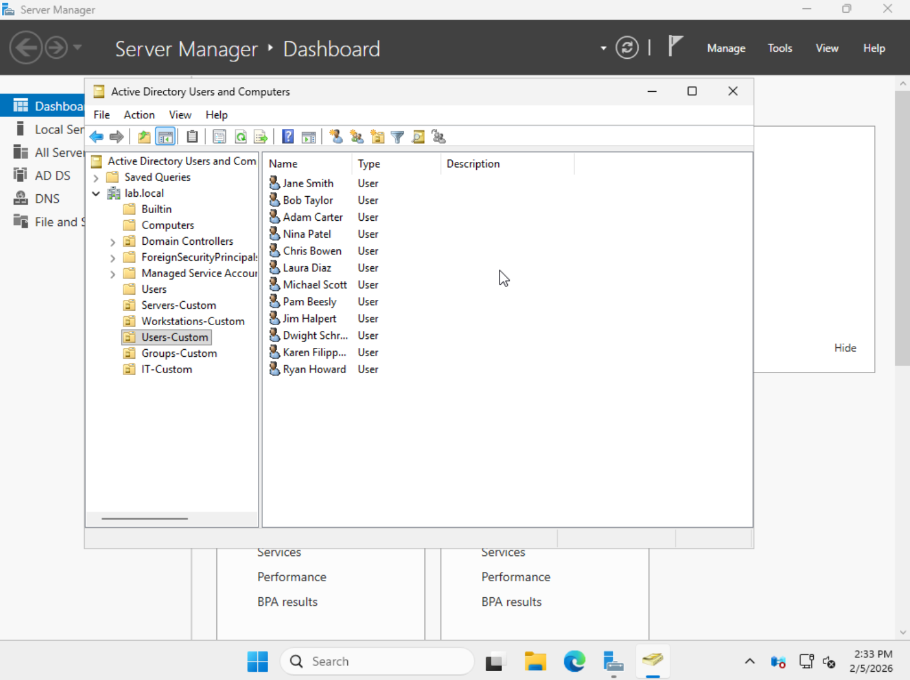
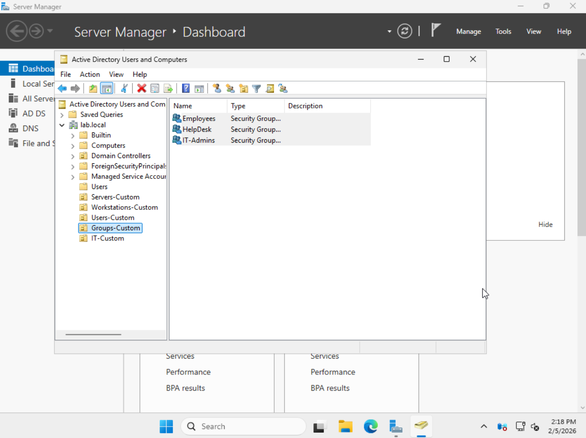
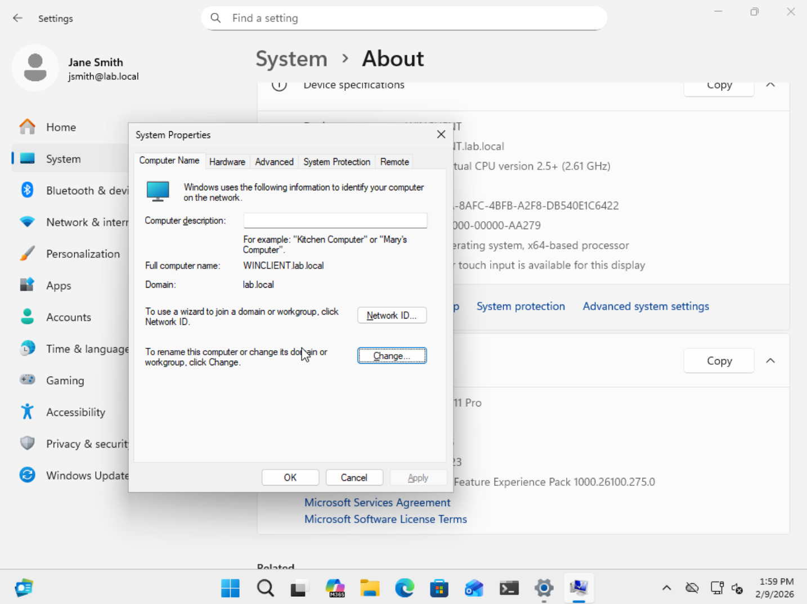
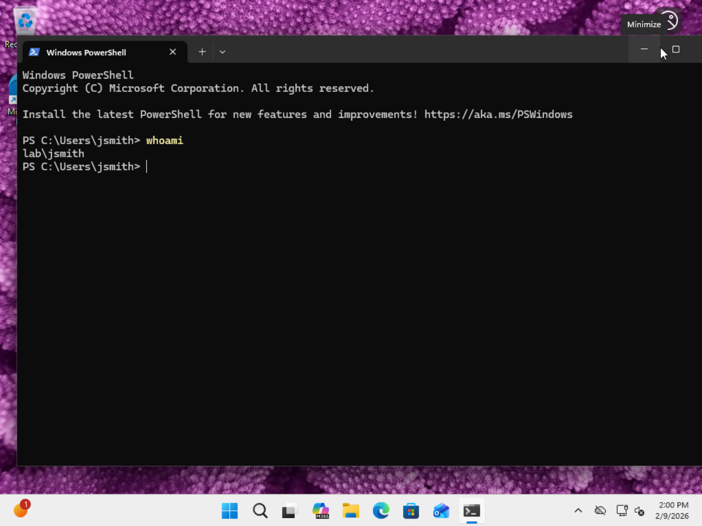
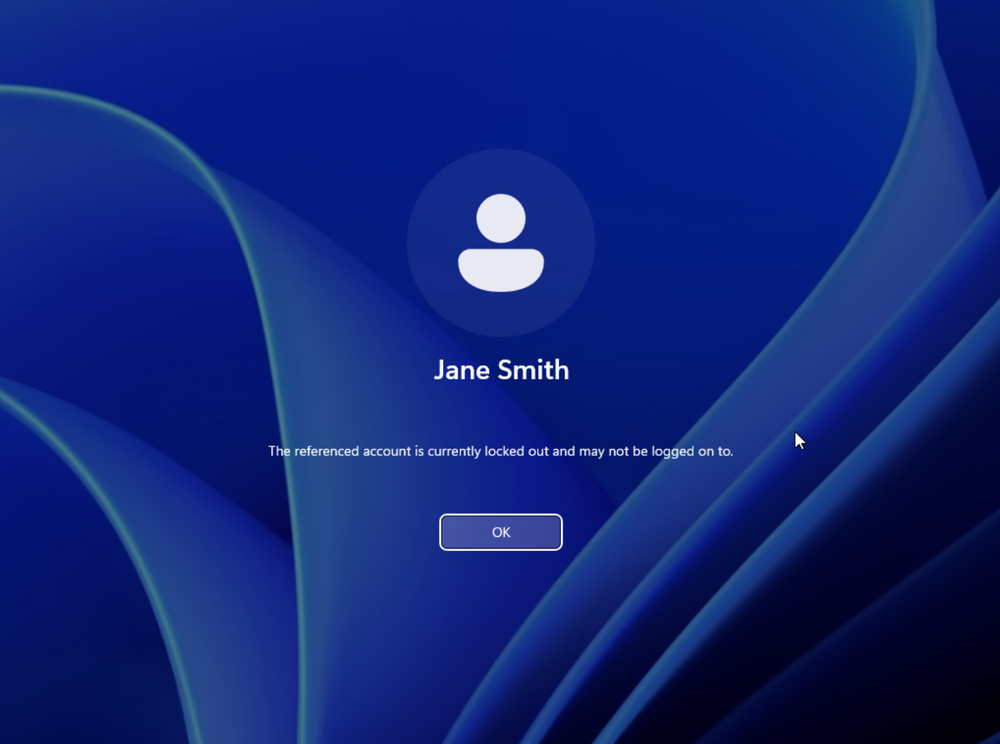
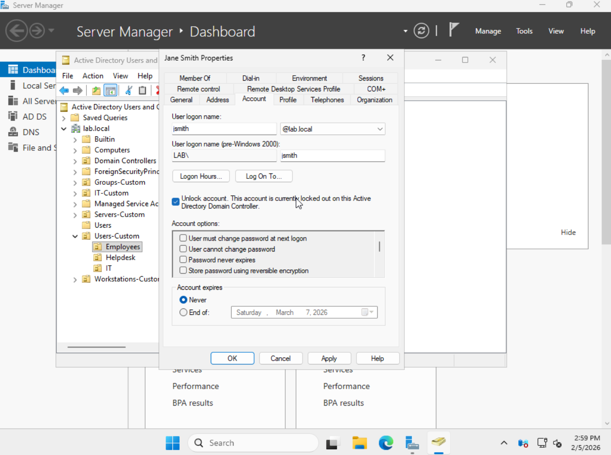

# Active-Directory-Homelab
Active Directory lab built on Proxmox to practice real-world IT skills like domain management, DNS troubleshooting, Group Policy, and user/group administration.

---

## Lab Overview
- Hypervisor: Proxmox VE (bare metal)
- Domain: 'lab.local'
- Servers and Clients:
  - Windows Server (Domain Controller + DNS) - 'DC01'
  - Windows 11 workstation (domain-joined)
-Networking
  - Single LAN subnet (domain DNS points to DC01)

---

## What I configured

### Active Directory Domain Services (AD DS)
- Created a new forest and domain: 'lab.local'
- Promoted 'DC01' to Domain Controller
- Built a custom OU structure (Users, Groups, Workstations, Servers, etc.)

### Users and Groups
- Created realistic user accounts
- Created security groups for role-based access (ex: Employees, HelpDesk, IT-Admins)
- Assigned users to groups based on role

### Group Policy
- Account Lockout Policy
- User restriction policy

### File and Permission Management
- Create a file share on DC01
- Configured share + NTFS permissions using security groups

---

## Skills Demonstrated
- Active Directory administration
- Group Policy creation + OU scoping
- Account lockout + unlock workflow
- Windows Server Administration + file share permissions
- Structured troubleshooting

---

## Screenshots

### Organizational Unit Structure
Designed a logical OU hierarchy to separate users, groups and administrative roles. 

### Users and Security Groups
Created multiple users and role-based security groups to simulate a real environment.

### Domain Join Verification
Verified the Windows 11 client successfully joined the domain.

 

### Domain User Authentication
Verified Acitve Directory authentication by logging in with a domain user account.

### Locked User Account
Simulated an issue by intentionally locking a user account after multiple failed login attempts.

### Unlocking a User Account
Unlocking the affected user account through AD Users and Computers and restored access.

### Group Policy Configuration - Control Panel Restriction
Created and scoped a GPO to restrict access to Control Panel and PC settings for standard users.

[GPO Working](09-gpo-working.png)
